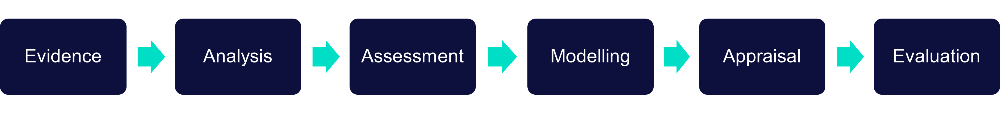

# About Us

Transport for the North (TfN) is the first Sub-national Transport Body (STB) in England. We were formed in 2018 to transform the transport system across the North of England, providing the infrastructure needed to drive economic growth.
TfN adds strategic value by ensuring that funding and strategy decisions about transport in the North are informed by local knowledge, requirements, and analytically backed evidence; more details on our work can be found on our website at [transportforthenorth.com](https://www.transportforthenorth.com/).

# Open Source Analytics

TfN has been building analytical tools for business cases since its inception in 2018. We believe that the best way to achieve the highest value for money from these tools is to share them with partners and other public bodies in the UK. Therefore, we share many of our analytics tools and processes on GitHub, allowing for transparency, scrutiny, and use by others.
The repositories fall into one of two categories: internal TfN, or Common Analytical Framework.
# Table of Contents 
- [Common Analytical Framework (CAF)](#common-analytical-framework-caf)
  - [What is CAF?](#what-is-caf)
  - [Who is CAF for?](#who-is-caf-for)
  - [When should I use CAF?](#when-should-i-use-caf)
- [CAF Overview](#caf-overview)
  - [CAF Tools](#caf-tools)
  - [CAF Models](#caf-Models)
  - [How CAF fits within the analytical process](#how-caf-fits-within-the-analytical-process)
- [Getting Started](#getting-started)
- [CAF Development](#caf-development)
  - [CAF Design Principles](#caf-design-principles)
  - [Governance & Development](#governance-and-development)
  - [Future Enhancements and Contributions](#future-enhancements-and-contributions)
- [Useful Links](#useful-links)
- [Contact Us](#contact-us)

# Common Analytical Framework (CAF)
## What is CAF?
The **Common Analytical Framework (CAF)** is Transport for the North's structured suite of analytical tools designed to support transport modelling, appraisal, and strategic decision-making.

CAF provides a consistent, transparent and reusable approach to:

-   Processing transport datasets
-   Developing modelling inputs
-   Running analytical workflows
-   Supporting forecasting and appraisal
-   Generating outputs for policy and business case development

CAF improves confidence, consistency and efficiency across TfN projects and partner organisations.
## Who is CAF for?

CAF is designed for:

-   Transport modellers and planners
-   Transport data analysts and engineers
-   Consultants delivering TfN-aligned work
-   Partner organisations exploring TfN tools

Note that the use of most CAF tools currently require some programming knowledge.

## When should I use CAF?

You should consider CAF when you need to:

-   Standardise and process transport data
-   Analyse land use data
-   Prepare modelling inputs, including NTEM datasets
-   Develop highway / public transport / freight matrices
-   Manipulate and transform matrices
-   Conduct carbon or appraisal analysis
-   Be consistent with other organisations

CAF tools can be used independently or as part of a wider analytical pipeline.

# CAF Overview
The Common Analytical Framework (CAF) is a collaboration between transport bodies in the UK to develop and maintain commonly used transport analytical and appraisal tools. The tools and processes that fall into this category generally are branded as "caf.X" and are built in collaboration with other transport bodies. CAF tools are generic and flexible processes which allow others to pick up and use in their analytics. The CAF has been built in many smaller modules to allow a range of use-cases, from taking an entire model as is, to selecting just to relevant components. 

For further information on the CAF, please see the [CAF Handbook](https://transport-for-the-north.github.io/CAF-Handbook/intro.html).

### Access Status
Note that some of CAF has not yet been migrated into the public domain. These tend to be tools that we have had some external interest in, but lack the resource to generalise at this time.

We use and develop these tools within TfN, sharing them to allow for others to benefit from our work, view our analytics, and  build upon them in their own work. Get in touch if you are interested in learning more about any private tools.

## CAF Tools
CAF tools are usually focused in scope, doing one specific thing, and have relatively small inputs/outputs. 

Examples include the processing of geospatial layers (CAF.space) to extracting PT data (opt4gb-py).

| Tool                                                                        | Description                                                                                                                     | Analytical Stage      | Target Audience  | Access |
| :-------------------------------------------------------------------------: | :----------------------------------------------------------------------------------------------------------------------------   | :-------------------- | :--------------- |:--------------- |
| [caf.space](https://github.com/Transport-for-the-North/caf.space)           | Tool for generating standard weighting translations in `.csv` format describing how to convert between different zoning systems | Data Processing       | Transport Modellers, Transport Planners, GIS Specialists | Public |
| [caf.distribute](https://github.com/Transport-for-the-North/caf.distribute) | Matrix distribution including gravity model and furnessing.                                                                     | Matrix Development    | Transport Modellers | Public |
| [caf.toolkit](https://github.com/Transport-for-the-North/caf.toolkit)       | Generic tools and functions that are used across transport analysis.                                                            | Model Development     | Transport Modellers, Analysts, Developers | Public |
| [NTS-Processing](https://github.com/Transport-for-the-North/NTS-Processing)  | Standardised tools for sampling and interacting with the National Travel Survey in a consistent way.                             | Data Processing                          | Transport Modellers, Analysts | Private |
| [BODS-Extractor](https://github.com/Transport-for-the-North/BODS-Extractor)  | Extracts and analyses BODS (Bus Open Data Service) data.                                                                         | PT Model Development / Data Processing   | Transport Modellers, Analysts | Private |
| [otp4gb-py](https://github.com/Transport-for-the-North/otp4gb-py)            | Produces cost metrics for public transport routing between origins and destinations using Open Trip Planner.                     | PT Model Development / Networks          | Transport Modellers | Private |
| [DLIT_LU](https://github.com/Transport-for-the-North/DLIT_LU)                | The Land Use Component of the Development Log Integration Tool                                                                   | Land Use Integration                     | Transport Planners, Transport Modellers | Private |
| [caf.base](https://github.com/Transport-for-the-North/caf.base)             | Core classes and definitions for use in other CAF models, including zone systems, segmentation and DVectors.                    | Foundational          | Analysts, Developers | Public |
| [caf.viz](https://github.com/Transport-for-the-North/caf.viz)               | Python visualisation utilities and styling components for presenting analytical outputs.                                        | Appraisal / Outputs   | Analysts, Developers | Public |

## CAF Models

CAF models are models in their own right, able to generate modelled data such as demand matrices (NorMITs-Demand) or carbon emissions (CAF.carbon). Inputs remain largely the same across runs, but arguments/segmentation etc. may change for specific use-cases.

| Repository                                                                   | Description                                                                                                                      | Analytical Stage                         | Target Audience  |  Access |
| :--------------------------------------------------------------------------: | :---------------------------------------------------------------------------------------------------------                       | :-----------------------------------     | :--------------- |:--------------- |
| [NorMITs-Demand](https://github.com/Transport-for-the-North/NorMITs-Demand)  | Collection of tools for taking land use data and converting into synthetic demand matrices, including forecasting travel demand. | Model Development / Matrices             | Transport Modellers  | Private |
| [Land-Use](https://github.com/Transport-for-the-North/Land-Use)              | Collection of tools for generating and forecasting detailed land use data.                                                       | Model Development                        | Transport Planners, Transport Modellers | Private |
| [caf-freight-tools](https://github.com/Transport-for-the-North/caf-freight-tools) | LGV model and HGV processing tools.                                                                                         | Model Development / Matrices             | Transport Modellers | Public |
| [caf.carbon](https://github.com/Transport-for-the-North/caf.carbon)         | Carbon analysis toolkit                                                                                                         | Appraisal / Outputs   | Transport Planners, Analysts | Public |

## How CAF fits within the analytical process
CAF tools align to different stages of the transport planning and modelling lifecycle.

Within CAF, the following modes are currently considered:

- **Public Transport** - rail, tram, and bus
- **Active travel** - walk and cycle
- **Highway** - Car, LGV, and HGV

CAF tools are tagged with the relevant modes and stage of assessment within their individual repository README.

------------------------------------------------------------------------

# Getting Started

Each CAF tool is maintained within its own repository, and most of CAF is Python-based.

To explore a tool:

1.  Navigate to the repository
2.  Review the README (contains details of the tool's purpose, inputs, outputs, and other technical details)
3.  Follow installation instructions
4.  Review example configuration files
5.  Set-up the tool or model as desired
6.  Run using provided CLI commands

Typical installation:

`pip install <package-name>`

Or clone directly via the following command or through GitHub Desktop:

`git clone https://github.com/Transport-for-the-North/<repository-name>`

Refer to each repository for detailed setup guidance.

------------------------------------------------------------------------
# CAF Development
## CAF Design Principles

Where possible, CAF tools follow consistent architectural principles:

### Processing Layer

-   Core logic separated from user interface
-   Structured inputs
-   Standardised result objects (e.g., JSON)
-   Clear logging and error messages

### Interface Layer

-   CLI-based execution
-   Consistent command structures
-   Designed to support web-based interfaces in future development

------------------------------------------------------------------------

## Governance and Development

CAF is maintained by Transport for the North.

Please use the Issues or Pull Requests section within the relevant repository to:

-   Raise an issue
-   Suggest enhancements
-   Contribute improvements

------------------------------------------------------------------------

## Future Enhancements and Contributions

CAF continues to evolve, including:

-   Improved discoverability and accessibility
-   Enhanced documentation consistency
-   Additional tools aligned with TfN's aspirations and goals
-   Greater integration with other TfN resources, such as visualisation dashboards

We encourage use of, and contributions to, the repositories within this organisation, licenses are provided within our repositories and contribution guidelines are outlined [here](https://github.com/Transport-for-the-North/.github/blob/main/CONTRIBUTING.md).

------------------------------------------------------------------------

# Useful Links

- [CAF Handbook](https://transport-for-the-north.github.io/CAF-Handbook)
- [Contributing Guidelines](https://github.com/Transport-for-the-North/.github/blob/main/CONTRIBUTING.md)

------------------------------------------------------------------------

# Contact Us

For further information, explore the repositories above, or contact
Transport for the North - <TfNOffer@transportforthenorth.com>

[Go to Top](#table-of-contents)
